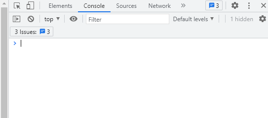

# 개발자 콘솔

> 브라우저는 스크립트에 문제가 발생해도 이를 사용자에게 직접 보여주지 않는다.

오류를 볼 수 있는 방법은 없는가? 브라우저에는 **'개발자 도구'**라는 것이 내장되어 있다. 이 도구를 이용하면 에러를 확인할 수 있다.

# Chrome

`F12`를 눌러 콘솔을 확인할 수 있다. Mac 사용자라면 `Cmd+Opt+J`를 누르면 된다. 그럼 아래와 같이 실행 될 것이다.  
  
화면의 구성은 Chrome의 버전에 따라 다를 수 있지만 큰 틀은 바뀌지 않는다.  
그럼 이번엔 콘솔 창에 간단한 값을 입력해 보겠다.

```js
console.log(hello)
```

위 값을 입력할 경우 오류를 잡아내는 모습을 알 수 있을 것이다. 이 처럼 간단한 오류를 개발자 콘솔 창을 통해서 확인 할 수 있다.
